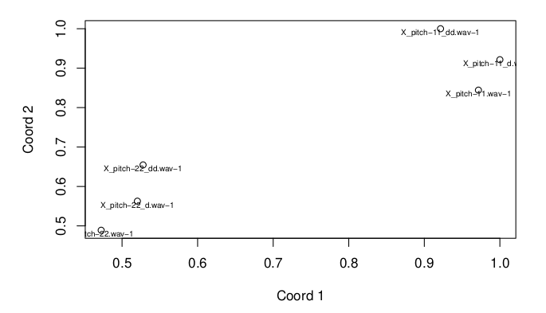

# [FREQUENCY CLASSIFICATION OF SOUND SAMPLES THROUGH THE REDUCTION OF DIMENSIONALITY](https://github.com/albertjimrod/personal_projects/tree/main/Master_thesis)

### Introduction

In the audiovisual field there is a professional profile that is the [sound designer](https://www.studiobinder.com/blog/what-does-a-sound-designer-do/). This is a professional for the general independent that is dedicated to the creation of sound effects with the aim of narrating, personifying, generate emotions, portray sound spaces, eras, and ultimately create a sound universe with a particular identity within the audiovisual context in which you are working.

The result of this work is a methodical and artisanal work where the volume of sound files that is generated for the development of a project is usually huge, so this can cause a loss of timbral perspective in the creative process, because the greater the volume of samples, it is easy for sounds end up being similar and as a result the originality of the work will be diminished.

A tool that analyzes the samples (only from the frequency perspective) in which the teacher sional is working and determine whether or not there is similarity between them is a solution that would save time when making decisions of a creative nature, as it will allow to establish what the predominance is frequency of the set and therefore know what is the timbral character of that group of samples.

The solution proposed to achieve this end is the application of one of the techniques seen in the predictive analysis with Machine Learning (Diego Calvo), referring to multidimensional scaling. While it is true that the solution is not innovative, it does not claim to be either. Only the imple- mentation of the knowledge acquired in ML in the most original way possible avoiding the dependence of external datasets through a field such as audio in which I feel comfortable and being the most honest with what was learned in the course.

### Abstract

Exercise of approximation to one of the techniques of Machine Learning, through a set of samples audio. The objective is to apply a method of organization widely used in the field of learning supervised and related to the reduction of dimensionality, this method of classification is carried out to through multidimensional scaling.

[Multidimensional Scaling](https://ncss-wpengine.netdna-ssl.com/wp-content/themes/ncss/pdf/Procedures/NCSS/Multidimensional_Scaling.pdf) (MDS) is a technique that creates a map displaying the relative positions of a number of
objects, given only a table of the distances between them. The map may consist of one, two, three, or even more
dimensions. The program calculates either the metric or the non-metric solution. The table of distances is known as
the proximity matrix. It arises either directly from experiments or indirectly as a correlation matrix.

MDS provides the marketing researcher with a map (scatter plot) of the six cars that
summarizes the results visually. This map shows the perceived differences between the cars.

