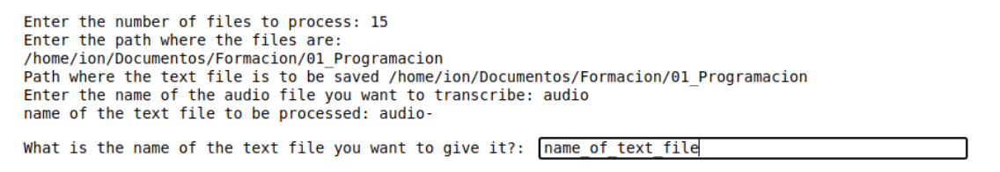

sonus transcriber

# Sonus transcriber

### October 17, 2021

### Preamble:

When I was studying for my [master's]((https://accounts.iebschool.com/mi-diploma/abaa0886b52591b851a33c17b4653f20/)) so with a *fair knowledge* of programming Python, but with a very great need to have the content of the videos transcribed, I had to build a **very simple tool** to be able to make the transcriptions of the Vimeo videos and have the text in lessons.

### Instructions:

– **Required items:**

- [Audacity](https://www.audacityteam.org/download/) , Is a open source, and with a couple of tools that I will describe later allows the implementation of this Jupyter notebook.

- [pavucontrol](https://pkgs.org/download/pavucontrol), [Manage the audio devices](https://www.addictivetips.com/ubuntu-linux-tips/manage-audio-devices-on-linux-pavucontrol/) on Linux. so I need to record (for example) the audio of a youtube video is using this small terminal application.

I see that there are also versions for Mac and Windows but I have not tested them…

### How it should all work together?

By taking advantage of [Google’s Speech API](https://cloud.google.com/speech-to-text/), what we do is **send our audio samples to Google, transcribe them and send them back to us**, so there are two things to keep in mind:

- **The language of the audio** we are sending must match with the tag , otherwise it will reject it, so I leave here languages Google API.

|Language|**code**|
|:--|:---|
|Afrikáans (Sudáfrica)|af-ZA|
|Afrikáans (Sudáfrica)|af-ZA|
|Albanés (Albania)|sq-AL|
|Albanés (Albania)|sq-AL|
|...|...|

- **Length of audio files:** If the audio file is too large (>1.5 minutes) according to Google, it will be rejected.

**Note**: This is the code line that must be modified if your audio files are not Spaniards and also as a Linux user:

- line 87 -> `archivo_texto.write((rec.recognize_google(audio, language="es-ES")))`
- line 7 -> `path` and \ instead / just for windows S.O.

### What should you do to record the audio?

Once the software pavucontrol is running (Linux Mint images) so signal is moving:

**Audacity**
Start up audacity and press record.

Stop recording and **mark** manually (The command to **mark is Control + b**) intervals of approximately 1 minute because, if one of the intervals fails, we will have to repeat Jupyter process!

This is an example image, in which the duration of the file exceeds 11 minutes and as you can see
I marked those parts that I found interesting.

In case you want to know more about Audacity, you can find all the information on their web site.

If you have clear your material what you must do now is to export the audio, exporting those
bits of audio in such a way that Sonus transcriber is able to understand the format.

Once we have reached this point we must configure how we are going to export the audio.

For work properlly we must select:

- **"tags"** <- **etiquetas**

- **"include audio before the first tag"** = Incluir audio antes de la primera etiqueta.

- In the right column we must select the option that is "shaded" inserting in the lower box the name we want to give to the multiple files that we are going to export.

## Jupyter

Once jupyter is running with **Sonus transcriber**, it will asks us a series of questions:

If all goes well create a **[name_selected_before].odt** separating and numbering the paragraphs.

That match the audio files this is so because sometimes it can be the case that it is not understood
and knowing where the part that does not understand or does not transcribe is very helpful when it comes to finding faults.

sometimes google also fails… sometimes, but mainly **you might have a corrects audio levels** that means you must normalize the audio.

Finally I hope you enjoy it as I have done all this and excuse for the programming mess, as you can see is just a sketch there are a lot to improve.

Thanks.
