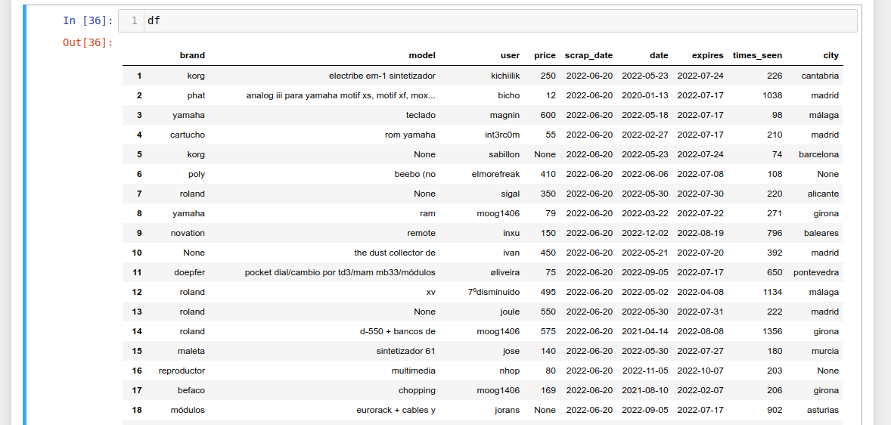
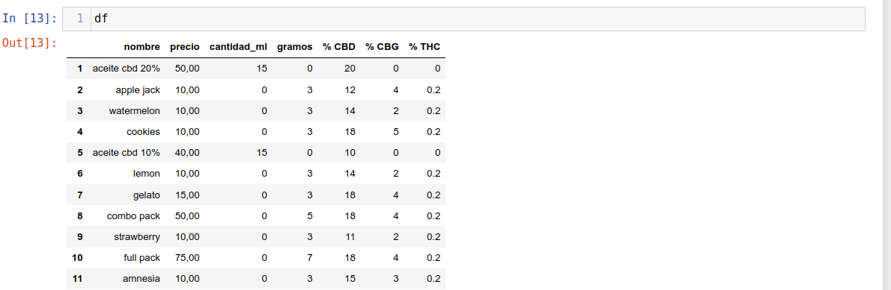

## Motivation to carry out the projects:

Obtaining the necessary data automatically for later use and regardless of the datasets that circulate on the Internet, is one of the tools that a data analyst must be in the toolbox (or at least that's what I think).

### Chronology: 

- [Hispasonic](https://www.hispasonic.com/anuncios/teclados-sintetizadores)
 
- [Xuxes](https://www.xuxes.store/) 

- [Eurogrow](https://eurogrow.es/)

### Things I've learned:

The issue I have experienced have been several:

#### Hispasonic:

 - This was the first project, and as such I only made use of the function libraries: requests and BeautifulSoup understanding that I had to continue took me many tests and time (a lot) but they were necessary to finish it,the most important challenge was to obtain the dates related to the day on which I did the scrapping.

#### Xuxes:

After having finished the previous project facing this one was not so difficult since it did not require dates however I began to realize that I needed another way to enter the code.

One of the things I had to fine-tune because I didn't know enough was to work with regular expressions which saved me most of the time.

#### Eurogrow:

- The need to get out of the comfort of using Jupyter notebook and learn how to use a new IDE. In this case Visual Studio Code.
- Understand that there is a systematized process in the extraction of data, through the use of function libraries such as:
 - Requests https://requests.readthedocs.io/en/latest/ the connection with the web to be studied.
 - BeautifulSoup: https://beautiful-soup-4.readthedocs.io/en/latest/ allows the extraction of data from documents of type HTML and XML.
 - Selenium (webdriver): https://www.selenium.dev/documentation/webdriver/ Controls a browser natively, as a user would, either locally or on a remote machine using the Selenium server, marks a leap forward in terms of browser automation.

Learn that there are pages which there are different technologies and that depending on how these pages are made we must access the data through a different strategy.

For example, a common technique when extracting information is to download those pages that contain what we need to avoid overloading the server pages, 
however in pages where AJAX is used that is where the sending and return of data by the server is done asynchronously, this is not possible since 
when opening the page in the browser it tries to connect to the server automatically making the use of this way of proceeding completely unfeasible.

Also in these projects have made me understand that it is as important to know what is the technology behind each of the pages, as to know what is the structure or importance of the library functions since all this will condition how I will have to make use of some techniques or others.

in this process one thing with which I have been realizing in each of the projects has been the need to improve the level of programming, it is true that I have seen an improvement from one to another but there is still a way to go.
